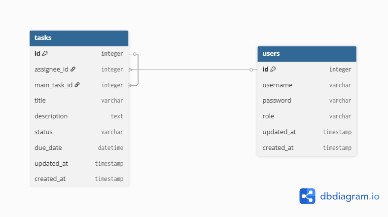

# Taskit

## Overview

Taskit is a task management application built using Laravel, designed for assigning and tracking tasks between users with clear roles and permissions. The app supports hierarchical tasks (main tasks and subtasks), status management, due dates, and role-based access.

## Architecture

- **Domain-Driven Design**: The codebase is organized around core domain concepts such as Task, User, and roles (Assignor/Assignee).
- **Controllers & Services**: Controllers (e.g., `TaskController`) delegate business logic to Services (e.g., `TaskService`), supporting cleaner separation of concerns.
- **Policies & Permissions**: Laravel Policies (e.g., `TaskPolicy`) enforce role-based access:
  - Assignors can create, update, and delete tasks.
  - Assignees can view and update the status of their assigned tasks.
- **Resourceful API**: The API exposes endpoints for task CRUD operations and status updates, with request validation and response formatting via Laravel Resources.
- **Task Hierarchy**: Tasks can have subtasks (`main_task_id` and `subTasks` relationship), supporting nested task structures.

## Database Schema

The main table is `tasks`, structured as follows:

- `id`: Primary key.
- `assignee_id`: Foreign key to users, the person assigned to the task.
- `main_task_id`: Nullable foreign key to another task (for subtasks).
- `title`: Task title.
- `description`: Task description (nullable).
- `status`: Task status (`pending`, `completed`, `cancelled`, `overdue`).
- `due_date`: Due date and time.
- `timestamps`: Standard Laravel timestamps.
- Indexes on `assignee_id`, `status`, and `due_date` for efficient querying.

**Diagram:**  
  
The above diagram visually explains the relationships between tasks, users, and subtasks in the database.

## Running the App

### Using Docker

1. **Clone the repository:**
   ```bash
   git clone https://github.com/MustafaAMaklad/taskit.git
   cd taskit
   ```
2. **Copy environment variables:**
   ```bash
   cp .env.example .env
   ```
   Edit `.env` as needed (DB credentials, app key, etc.).

3. **Build and start containers:**
   ```bash
   docker-compose up --build
   ```

4. **Install dependencies (in the container):**
   ```bash
   docker exec -it <container_name> composer install
   docker exec -it <container_name> npm install && npm run build
   ```

5. **Run migrations:**
   ```bash
   docker exec -it <container_name> php artisan migrate
   ```

6. **Access the app via the mapped port (see `docker-compose.yaml`).**

### Using MAMP/XAMPP (Manual Setup)

1. Set up your local Apache/Nginx and MySQL using MAMP/XAMPP.
2. Clone the repo and place it in your web directory.
3. Copy `.env.example` to `.env` and configure database credentials for your local MySQL.
4. Install PHP dependencies:
   ```bash
   composer install
   ```
5. Install frontend dependencies:
   ```bash
   npm install && npm run build
   ```
6. Generate app key:
   ```bash
   php artisan key:generate
   ```
7. Run database migrations:
   ```bash
   php artisan migrate
   ```
8. Serve the app:
   ```bash
   php artisan serve
   ```
   Or access via your local web server.

## API Collection

A Postman collection (`taskit.postman_collection.json`) is provided to test API endpoints.
